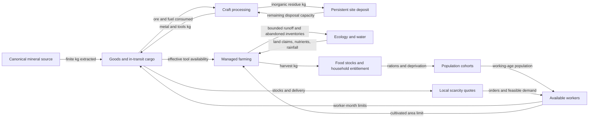

# Model verification, coupling evidence and calibration status

This is the evidence entry point, not a claim of scientific validation. The model
is intended to generate internally accountable fictional landscapes and history.
Finite transfers, bounded production and reproducible interventions are testable
requirements. Patron biology, continental geometry and many response coefficients
are design assumptions. Existing documents called “calibration” mostly describe
**game balancing or diagnostic seed evaluation**, unless they explicitly name
external target observations and a fitting/held-out procedure.

The documentation structure follows the motivation of [Grimm et al. (2020), ODD](https://doi.org/10.18564/jasss.4259):
state the model, rationale, implementation details and evaluation separately.
This first report specifies the investigated coupling slice. It is **not yet a
complete ODD description of every subsystem**. That remains a documented gap.

The first completed investigation is [mine access × labor allocation](mine-staffing-evidence.md),
with all branch results and an execution manifest committed alongside the report.

## Reproduce

From the repository root with Rust 1.89.0 and Python 3:

```sh
python3 scripts/evidence.py --profile full
```

On the development machine:

```sh
python3 scripts/evidence.py --profile full --cargo 'mise exec rust@1.89.0 -- cargo'
```

The default unique `output/evidence-<UTC>/` directory contains a manifest, stage
logs, checksums, checkpoint branches, monthly JSON and generated Markdown tables.
Monthly JSONL journals retain completed observations if a later step fails.
Source edits during a run invalidate its completion status.
Existing output directories are rejected; stale success files cannot complete a
new run. Nonzero exits, missing test executions, incomplete experiment JSON and
interruptions leave the run incomplete and return failure. Earlier successful
stages remain available for diagnosis. An externally killed process may retain
`running`, which is explicitly not complete.

Profiles:

- `cpu`: formatting, lint, runner checks, ordinary Rust unit/integration fixtures;
  hardware tests remain visibly ignored. Completion means CPU coverage only.
- `focused`: CPU plus resource, economy, residue, environmental-return, independent
  drainage and two-box aquatic exchange GPU tests, then the mine experiment.
- `full`: CPU plus **all ignored Rust library/integration tests**, serially, then
  the mine experiment. New ignored tests automatically enter this scope.

Default experiment: seeds 17, 81, 256; terrain 64/ecology 32; crop yield scale
0.33; one geological epoch; sixteen initial civilizations; one-year spin-up;
five years closed followed by five reopened. `--seeds`, `--closure-months` and
`--recovery-months` allow smaller diagnostics; `--tool-fractions 1,0.25,0` adds the
[conserved starting-tool intervention](tool-buffering-evidence.md); the manifest records the choice.
These seeds have been used for development and are **not held out**.

CPU CI runs on pushes and pull requests. A manual GPU workflow requires a trusted
self-hosted runner labeled `linux,vulkan-gpu`, provisioned with Rust, native
libraries, Python and a hardware Vulkan driver. Adding the workflow does not
provision that machine or prove a CI execution. The manual opt-in prevents
executing arbitrary pull-request code on the development GPU host.

## Claim-to-test traceability

Status here means an available executable check, not a promise that it passed on
all hardware. Consult the manifest for actual execution and failures. Tolerances
are numerical regression bounds chosen for these fixtures, **not measurement
uncertainties**. Most Rust fixtures assert bounds rather than export maximum
errors; their logs therefore establish pass/fail, not an unrecorded error value.

| ID | Requirement / implementation | Executable evidence | Scope / remaining gap |
|---|---|---|---|
| GRID-1 | Reciprocal cube-face neighbors and total solid angle; `src/grid.rs` | `tests/core.rs::cube_sphere_topology_and_area` | 8/16/32 edges, area error <1e-10; not a response-resolution study |
| HYDRO-1 | Spill surface and acyclic routes; `shaders/simulation.wgsl` | `tests/gpu.rs::gpu_drainage_matches_priority_flood` | Independent CPU priority-flood reference; constrained test worlds |
| HYDRO-2 | Lake retention/overflow and seam water transfer | `secondary_lakes_share_surface_and_conserve_volume_across_seam`, `nested_pools_wait_for_saddle_and_overflow_conservatively` in `tests/gpu.rs` | Small controlled basins; not observed discharge fitting |
| ECO-1 | Conservative aquatic exchange | `tests/ecology.rs::isolated_lake_exchange_matches_cpu_two_box_reference` | Independent two-box calculation; no lake-circulation empirical validation |
| ECO-2 | Energy and nutrient limitation | `no_energy_and_no_phosphorus_limit_growth`, `hydrogen_symbiosis_uses_finite_reserves_and_declines_without_supply` in `tests/ecology.rs` | Direction and finite reserves; extraordinary symbiosis is fictional |
| FARM-1 | Managed withdrawals share ecological inventory | `tests/economy.rs::plot_reservations_and_gpu_recipes_conserve` | C/N/P, water and goods ledgers; aggregate land fractions |
| LAND-1 | Runoff/abandonment/reoccupation transfer finite stocks once | `tests/environmental_returns.rs::abandoned_land_returns_once_and_continues_after_checkpoint` | Three seeds; continuation and budget checks; downstream response calibration still pending |
| MINE-1 | Town extraction debits shared sources, surveys retain depletion | `tests/resources.rs::shared_sources_connect_mining_surveys_markets_and_checkpoints` | Canonical parent resources, not full regional subcell partitioning |
| CRAFT-1 | Identified ore, fuel, metal and physical residue balance | `tests/mineral_processing.rs`, `tests/alloy_processing.rs` | Controlled minerals and storage limits; no empirical recovery fitting |
| TRADE-1 | Goods leave sender, travel, arrive; payment occurs once | `tests/economy.rs::markets_reserve_cargo_pay_once_and_respect_closure`, metallurgy unit fixture | Conservation and physical identities; not a validated historical market |
| LABOR-1 | Idle industry releases labor; fixed-share ablation holds ratios | `idle_industries_release_workers_without_consuming_new_resources`, `diagnostic_fixed_staffing_preserves_worker_shares_and_budgets` in `tests/economy.rs` | Workforce remains finite; fixed shares intentionally suppress adaptation |
| TOOL-1 | Restricted equipment stays conserved and cannot support production | `tests/economy.rs::restricted_tools_conserve_custody_and_resume_without_becoming_usable` | Sealed experimental custody; actual GPU production probes; legacy ordinary tools only |
| FOOD-LABOR-1 | Food pressure changes finite staffing and preserves control trajectories | `food_security_staffing_reacts_without_free_workers_and_resumes`, `ration_limited_muster_cannot_overdraw_by_rounding`; [experiment](food-security-labor.md) | Opt-in; final focused coverage, not empirical fitting; [maintenance ablation completed](maintenance-ablation.md), benefit mixed |
| CLOCK-1 | Save/resume and monthly batches agree | `tests/environmental_returns.rs`, `tests/resources.rs`, `tests/living.rs` | Same backend; not cross-GPU bitwise equivalence |
| CAUSE-1 | Mine access affects measured production without deleting stock | `examples/coupling_evidence.rs` | Matched 2×2 experiment, monthly mediators, no-op; model causality only |
| ROBUST-1 | Full verification executes instead of silently skipping hardware | `scripts/evidence.py --profile full` | Run-specific backend; other devices remain untested |
| EMPIRICAL-1 | Fit targets and evaluate independent observations | **Not implemented** | No calibrated coefficients, uncertainty intervals or held-out validation claimed |

## Coupling map

Arrows label either physical transfers or information/constraints; they do not
all represent material flow. Each physical pool has one authoritative inventory.



## State, units and update contract for the investigated slice

The canonical geological `Source` holds initial, remaining and extracted material
in kg (`src/resources.rs`). Site ore/clay availability is an extraction reservation
against that inventory, not another deposit. Ownership/access policy can prevent
withdrawal without deleting source material. New settlements retain independent
access; treatments target the stable site IDs existing at the fork.

`Economy` stores goods in kg, soil/detritus/forest as absolute kg C/N/P, stored
water in m³, labor in worker-month equivalents, and cash in abstract currency.
`Stocks` holds fractional population equivalents, food kg calorie-equivalent,
and cumulative production/consumption/spoilage and demographic exchange ledgers.
`Demography` retains last-month ration need/eaten by age group and household food
access. Named people are sparse records, not one record per population unit.

Ecology stores inventories per m² on its own cube grid. Transfers convert with
spherical area and retain fine receiving-cell identity. A source debit and matching
destination credit may appear as “external” in each subsystem ledger; they are an
internal transfer at the combined system boundary. Closed local budgets alone do
not establish this cross-boundary equality; LAND-1 and FARM-1 exercise that contract.

For living history, `Generator::advance_history` coordinates one ecological month,
managed site production/consumption and sparse history updates, then commits managed
withdrawals/returns before another environmental month or checkpoint. Geological
epochs do not advance in these experiments. Access policies and catalog changes
apply at completed boundaries. Ordinary monthly decisions continue in both branches.

Initialization and boundary forcing: Earth-sized default radius/tilt, constrained
inner continents and enclosing continent, procedural geology/climate, declared
founding inventories, fixed geological terrain during the social interval. Monthly
weather and ecology continue. No free tool stocks or aid are injected by the
mine experiment. Legacy shared ore/clay processing is deliberately retained to
match the original counterfactual; alloy processing is tested separately.

## Actual rules and assumptions

These expressions transcribe the implementation; they do not imply empirical
justification. Complete managed crop/animal rules are in `shaders/economy.wgsl`
and the editable economy catalog; this section is the coupling slice, not a
replacement for that larger specification.

- **Mining:** total monthly ore + clay extraction is bounded by `5 × mining_workers`
  kg, individual source availability, requested order room and storage. Ore/clay
  priority alternates monthly. The 5 kg/worker-month coefficient is a game setting.
- **Adaptive labor:** feasible material orders predict forest/mining/craft demand.
  Shares relax 25% toward desired staffing monthly; farming retains at least 62%.
  Resource, workshop, storage and previously reserved service-labor constraints
  bound proposals (`worker_shares`). This is a heuristic allocator, not a wage equilibrium.
- **Fixed-share diagnostic:** `diagnostic_fixed_labor=true` gives proportions
  `(0.62, 0.08, 0.10, 0.20)` for farm/forest/mine/craft, deducting 0.001 from forestry
  for an operating managed fishery. It freezes proportions, **not headcount**;
  disease and population still change available labor. No inputs become free.
  It overrides both adaptive and legacy shortage-driven reassignment. Defaults
  and older archives retain `false`; the option persists in the economy catalog.
- **Farm tools:** `tool_factor = 0.75 + 0.25 clamp(effective_tools / max(1, 0.5 population), 0, 1)`.
  Effective tools include ordinary tools, bronze tools and 0.6× copper tools when
  alloy mode is enabled. The maximum direct multiplier benefit is 1/0.75, not an
  unlimited growth factor. Nutrient/water/land limits may prevent realizing it.
- **Local prices:** `base_price × clamp(target / max(1, stock + 0.25 target), 0.4, 4)`.
  Stocks and desired reserves drive bounded scarcity quotes. These are abstract
  decision signals, not fitted ancient-world prices (`History::market_month`).
- **Managed runoff:** overflow `R = max(0, stored_water - capacity)` in m³;
  exported dissolved C/N/P fraction `min(0.05, R / max(0.2 area_m², 1))`.
  This debits soil and credits the actual fine river cell. The 5% cap is a design
  safeguard, not a fitted leaching rate. Transport occurs before downstream use.
- **Population accounting:** final people plus in-transit people must account for
  initial people + births − deaths + declared external movements. Site immigration
  and emigration alone cannot explain a global increase; births/deaths must be
  examined alongside it. Checkpoint cohorts remain the starting state in all branches.

An example of why formal climate documentation is still required: the current
`climate` kernel uses `solar=cos(latitude−tilt sin(2π season))` and
`T*=clamp(−20+55 solar−0.006 max(elevation_m,0),−90,55)` °C, then blends toward T*
with weights 0.12 over water and 0.35 over land per relaxation step. Vapor blends
65% from an upwind cell, receives local supply, and loses bounded precipitation;
precipitation is scaled by 365 for mm/year reporting. These are heuristic rules,
**not a solved radiative energy balance**. Grid/iteration sensitivity must be
measured before attaching climate-accuracy claims.

## Experimental design and interpretation

Each seed yields one saved year-one state. Four branches cross mine closure with
normal/fixed staffing. Closure lasts 60 months, then access returns for 60 months.
An independent no-op branch calls the access API with already-open policies and
must match the original full serialized social state plus environmental budget
samples after one month. This is a negative control for that API and restart;
it does not establish arbitrary scheduler/order invariance or every GPU byte.

Every month records each site's production, food stocks, rations, all four worker
pools, ore price, tools, births/deaths/movement ledgers, canonical sources and
budget residuals, including travelers and total-population accounting. Tables
explicitly distinguish settled people from total living population.
`abs(normalized economy residual)<0.001`, `abs(population residual)<0.001`, absolute source mass
residual <0.001 kg, finite values, and the ecology budget's own tolerance must hold.
These are failure guards; actual measured maxima are reported alongside them.

Compare immediate extraction differences first, then labor/food responses, then
population. Compare closure effects **within** each staffing regime before
comparing those paired effects across regimes. Fixed shares also change the
baseline economy; this is an interaction experiment, not a uniquely identified
natural indirect effect. Failure to remove the population effect would motivate
controlled tool availability and food-entitlement follow-ups. Reopening need not
make nonlinear histories converge.

The [four-policy held-out evaluation](maintenance-ablation.md) adds 5,760 monthly
observations with a separate maintenance ablation. It supports food-pressure
response in the tested open-mine cases, but not a general benefit from reserving
industrial capacity. No coefficients or defaults were tuned against these seeds.

The [living-history fishery intervention](living-scenarios.md) adds a three-seed,
five-branch controlled experiment: wildlife removal changes catch and food reserves;
an absent-guild negative control does not, and disabling harvest blocks the immediate
food effect. It establishes this mediator chain with finite transfers and checkpoint
equivalence, not long-term demographic effects or ecological calibration.

The [natural-stock follow-up](natural-fishery-trajectories.md) adds three ten-year
seed suites and one fifty-year yield-0.33 stress suite, with sham and harvest
controls. Catch responds strongly, while the current fishery contributes less
than 0.031% of aggregate ration need. Catch recovery precedes wildlife inventory
recovery. These trajectories expose weak dietary relevance rather than establish
a calibrated fishery-dependent economy.

## Outstanding evidence

1. Expand the state/equation/unit specification beyond this coupling slice, especially
   climate iteration units, managed crop growth, demography and political transitions.
2. Separate subsystem error maxima from pass/fail assertions in older fixtures.
3. Downstream runoff response experiments with locality/lag controls, and long
   abandoned-land recovery trajectories; existing inventory transfer tests are insufficient.
4. Tool availability and entitlement mediator interventions with explicit stocks/payments.
5. Fixed-physical-field resolution experiments, time-step/iteration sensitivity,
   stable-ID settlement-order tests, independent hardware and debug/release comparison.
6. Register sourced target distributions and plausible parameter ranges, joint
   sensitivity screening, a fitting objective, and genuinely held-out evaluations.
   Development seeds and fictional design targets must not be labeled empirical validation.
7. Property-based/mutation testing targeted at transfer bugs. A large ordinary
   test count cannot substitute for these or for measured code/requirement coverage.

The [adaptive-fishery follow-up](adaptive-fisheries.md) verifies finite equipment,
workforce competition, demand and stock limits, and exact checkpoint continuation.
Its natural seed ensemble does **not** establish fishing specialization; the policy
remains experimental and disabled by default.

The [timber-trap experiment](timber-fisheries.md) resolves the demonstrated equipment
bootstrap failure using a finite, lower-productivity alternative. Three seeds and a
harsher variant establish fisheries, but the pressure case has worse aggregate food
security with fishing enabled. It therefore supports the equipment mechanism while
rejecting catch growth as sufficient evidence of a beneficial economic calibration.

The [opportunity-cost follow-up](fishery-opportunity-cost.md) adds a same-checkpoint
rule ablation, an analytical memory recurrence and an idle-workforce equality check.
Five seven-branch comparisons show improved food security relative to the ablation,
but primarily by rejecting fishing. It supports the allocation safeguard while leaving
natural fishing specialization and commercial fish reservations unestablished.
